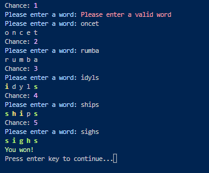

I wanted to track my progress of learning Rust and I wanted to share some of the things I've learned.
Therefore I created this repository. It contains some snippets of code I've written and some of the things I've learned from day 1.

The learning projects I have currently built are:

1. [Number guessing game CLI in Rust with colored text.](#number-guessing-game-cli-in-rust-with-colored-text)
2. [Rock Paper Scissors game CLI in Rust with colored text.](#rock-paper-scissors-game-cli-in-rust-with-colored-text)
3. [Wordle game CLI in Rust with colored text.](#wordle-game-cli-in-rust-with-colored-text)

# Number guessing game CLI in Rust with colored text.

Things I've learned:

- How to import functions from other files.
- print! doesn't flush the output to the screen.
- String multipication in Rust.
- How to work with dependencies.
- Glimpse to the borrow checker.
- Glimpse to the mutability checker.

# Rock Paper Scissors game CLI in Rust with colored text.

Things I've learned:

- Now have a okay understanding of the borrow & mutability checker.
- Learning how to use the `match` keyword.
- Tuples in Rust.

# Wordle game CLI in Rust with colored text.

Things I've learned:

- `static` variables in Rust.
- packaging into different folders.
- Some String methods and how to manipulate strings in Rust.
